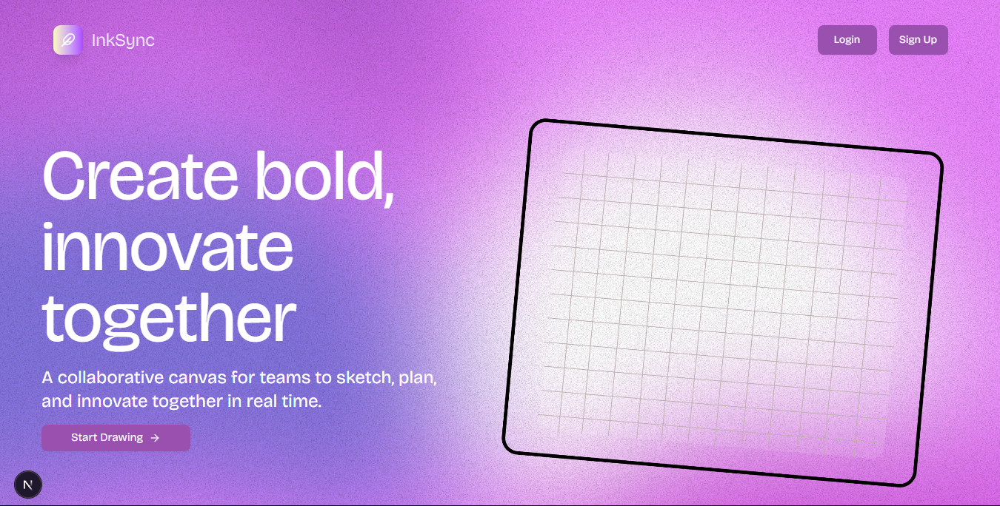
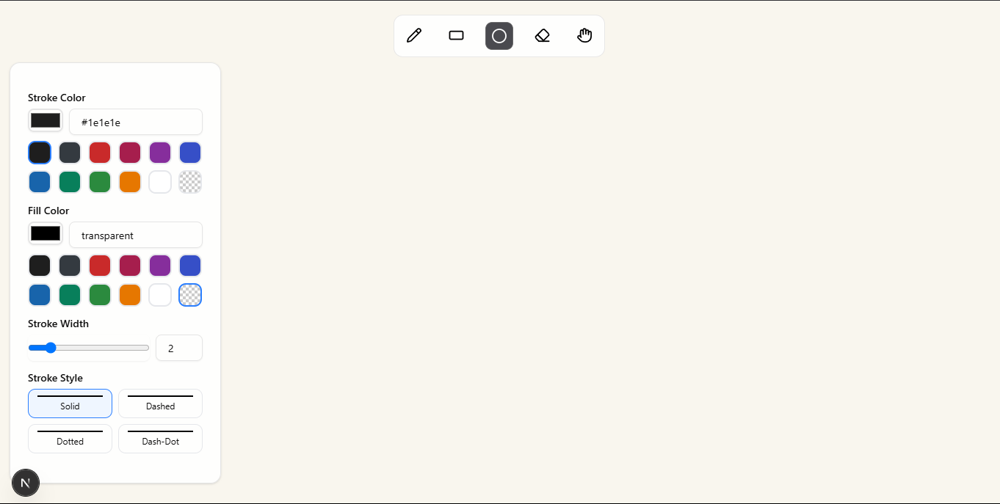

# INK-SYNC

Create Bold Innovate Together.



#About

Inksync is a collaborative, real-time whiteboard application inspired by Excalidraw. Built using Next.js, WebSockets, Express, Prisma, and NeonDB, it enables users to create, draw, and share diagrams seamlessly. The app supports live multi-user collaboration, autosave, undo/redo functionality, and intuitive drawing tools—all in a lightweight and responsive interface.

## What Inksync can do?

Collaborate on a shared whiteboard in real time

Draw shapes, arrows, and freehand sketches effortlessly

Invite others to join your drawing sessions instantly

Use undo/redo to easily fix mistakes or revisit changes

Organize ideas visually with a clean and distraction-free interface


 ## Glimpse


```

### Develop

To develop all apps and packages, run the following command:

```
clone the Repo
cd inksync
pnpm install
pnpm run dev
```


